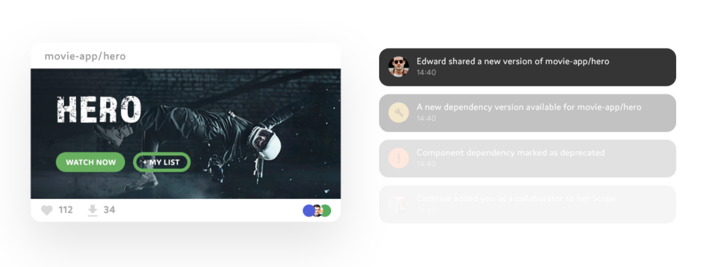

### The problem

The world of frontend development is getting more complicated by the hour. There are new frameworks, tools, techniques, and user requirements every time I decide to read some news and tweets to catch up.

Finding a direction in that kind of quick and always changing environment is difficult. One way of finding a stable ground is organizing the code by some standard or a **design system**.

### Atomic Design

It is a system that recognizes hierarchy, importance, type, and role of each and every component. The components are combined in a way that resembles the structure of our universe.

- atoms
- molecules
- organisms
- templates
- pages

#### Why

The need for some kind of a design system appears when we start to get overwhelmed by the count of components on a project. In projects where there are a hundred or two hundred components, it is not easy to remember everything.


#### Origin

The mind behind this system is Brad Frost, and for those of you who want to learn more about it feel free to stop right here and first read his in-depth post on the subject. There is even a [book](https://shop.bradfrost.com/collections/frontpage/products/atomic-design-print-ebook).

### Example UI

In my quest for the perfect UI to recreate, I could not find anything that satisfied me completely. This is the closest I could find.


I will not try to pixel perfect it nor achieve the exact same layout. The goal here is to showcase the separation of components.

#### Breakdown

I do not consider this a deterministic process. I am certain there are better ways to decouple this UI into components but the essence is the same, make them more manageable. I will use the top-down approach.

- **one page** - dashboard
- **two templates** - header and workspace
- **many organisms** - tools, time, map,…
- **even more molecules** - tool buttons, temperature info, feed items,…
- **probably even more atoms** - labels, icons, links, headings,…

#### Cataloging

Making every component decoupled and available in an **online catalog** will make it easier for future developers to find and use them.

### Share and compose UI components with Bit

Bit is an open source tool ([GitHub](https://github.com/teambit/bit)) and [platform](https://bitsrc.io/) that lets you create a collection of your favorite UI components to discover and share.

Using Bit you can share reusable components from different projects, play with them online in a live playground, and consume them from any project.

Components are easily isolated, hosted and made available with NPM to install anywhere. You can also use Bit itself to develop and sync changes to components right from any project you’re working on.

It solves common problems of managing component systems and saves developers from reinventing the wheel while increasing their productivity. Below is an example of a rendered component pushed to the Bit scope. For more information watch this [video](https://www.youtube.com/watch?v=P4Mk_hqR8dU).



#### Result

In the end, I created 15 components that can be combined to build the view from the example UI. The charts are not included because they are out of the scope of this article. Components are cataloged and available on this [link](https://bitsrc.io/stjepangolemac/atomic-design). The repo that contains whole code can be found [here](https://github.com/stjepangolemac/bit-atomic-design).

After the development, it is really easy to make your own catalog of components. You just need to [sign up](https://bitsrc.io/signup) on the bitsrc.io, then type in a few short commands and you are done.

```bash
# Navigate to the project directory and initialize Bit
$ cd project_dir
$ bit init
$ bit login
# Add the components to the local scope
$ bit add src/components/atoms/*
  ...
$ bit add src/components/pages/*
# Check if all components are added
$ bit status
# Tag the version and upload the components to Bit
$ bit tag --all 1.0.0
$ bit export <your_username>.<your_scope>
```

The result can be seen on this [link](https://bitsrc.io/stjepangolemac/atomic-design). That is a scope, think of it like a namespace for exported components. You can have as many scopes as you want, and you can make them private or public.

Let us see the `<Panel />` component [here](https://bitsrc.io/stjepangolemac/atomic-design/atoms/panel). There is support for component documentation, testing, building, and compiling. You can even explore file structure and code.

```bash
$ bit init
$ bit import <your_username/<your_scope/avatar-image \
  --path src/components/avatar-image
```

You are now able to use these components in any future project by just importing the component. You do need to make sure the project that you are importing the components in supports bundling of resources used. For example, components from the link above import .css files.

You should definitely explore features that Bit offers like component **rendering**, **testing**, and **documenting**. The best place to start is the [official documentation](https://docs.bitsrc.io/docs/quick-start.html).


### Summary

[Bit](https://bitsrc.io/) is a refreshing new tool that makes it easier to manage **modular** and **reusable** components in a standardized way. Developers should focus on the project requirements and quality code delivery, they should not worry about the usage of their components in other projects or by other people.

**[Give Bit a try](https://bitsrc.io/)** and if you have any question feel free to ask for help on [Gitter channel](https://gitter.im/bit-src/Bit) or open an [issue/PR on GitHub](https://github.com/teambit/bit)!
