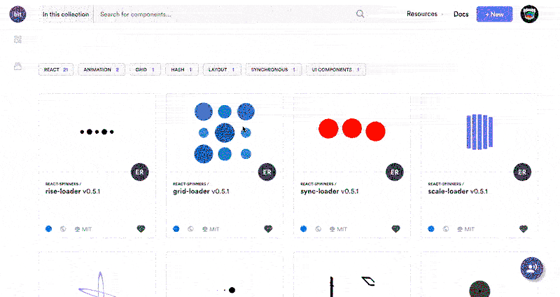

A common mistake when writing business logic in web apps is code duplication. If a component needs to fetch user data the first thing that comes to mind is fetching it in the `componentDidMount` hook. The problem with that is repeating the code in every component that needs the same data.

What if the logic for data fetching is written only once, and just invoked when needed?


### Redux saga

Imagine separate threads that can listen to dispatched actions, and react to them by executing some logic and dispatching other actions. That is technically not accurate but good enough to get an initial idea.

For those that want to thoroughly understand `redux-saga`, be advised to see the [official documentation](https://redux-saga.js.org/).

It is a Redux middleware that executes sagas (for now think of them as plain functions) based on dispatched actions. There are some similarities to Redux reducers although they are very different things.

- there is a root saga (remember root reducer?)
- they can read and change state (indirectly)
- they can be combined and reused

---

**Tip**: Use [Bit](https://github.com/teambit/bit) to share and reuse your components between apps. It helps you discover and play with components, using them to build faster. Give it a try.

[](https://bitsrc.io/components)

---

#### Why saga?

The name redux-saga comes from the concept of long-running transactions that are modeled and known by the _saga design pattern_ name. The pattern attempts to resolve the problem of complex interactions between different services.

For example, when the user is requesting a particular resource from a server the request needs to be authenticated. The process of authentication can be modeled as a saga.

Web applications often have many processes that could benefit from this design pattern such as multi-stage data fetching, interpreting complex user interactions and monitoring the user or application state. Saga is the comb for the tangled hair of application logic.


#### Generators

In redux-saga, sagas are implemented with the help of generator functions. They are a part of the ES6 standard and are supported by all major browsers besides IE. With the help from [Babel](https://babeljs.io/), generators can be used in IE and older browsers too.

A generator cannot be used directly as it needs to be instanced before. After the instantiation, it is executed by calling the `next()` function. When the generator is finished it will return the `done` flag.

```js
function* generator() {
  yield 1
  yield 2
  yield 3
}

const gen = generator()

gen.next()
// { value: 1 }

gen.next()
// { value: 2 }

gen.next()
// { value: 3, done: true }
```

The generator code should be straightforward except the `yield` keyword. It is very similar to the return keyword as it returns the value. The difference is that when the `next()` function is called again, execution will continue from the last `yield` statement.

Here is a generator that outputs numbers from the Fibonacci sequence.

```js
function* fibGenerator(limit) {
  let current = 0
  let next = 1
  let temp
  for (let i = 0; i < limit; i++) {
    temp = current
    current = next
    next = temp + next
    yield current
  }
}

const fib = fibGenerator(3)

fib.next()
// { value: 1 }

fib.next()
// { value: 1 }

fib.next()
// { value: 2, done: true }
```

For an in-depth introduction to generators, I suggest starting with this [MDN web doc](https://developer.mozilla.org/en-US/docs/Web/JavaScript/Reference/Statements/function*). Enough theory, now the main attraction.


### Authentication Monitor

Every web application needs to fetch its data from a server that may or may not be protected from public access. The most common way of authentication today is the usage of JSON web tokens or [JWT](https://jwt.io/).

A client needs to include the server-issued JWT in the header of every request that queries non-public data. When the JWT is expired or not valid the server will return the 401 status code.

Authentication failure can be handled in many different ways and often the best approach is to refresh the token and try again. That process can be isolated and solved with sagas.

For the example to be simple and understandable there should be some rules for the Redux logic.

#### Assumptions

1. Every interaction with the server is implemented as a three action process consisting of these states: REQUEST, SUCCESS, FAILURE.
2. Failures should contain the error as a payload of the action.
3. There should be a mechanism to prevent monitoring of some actions.

#### Implementation

For those who want to see the finished code, it is available in [this repo](https://github.com/stjepangolemac/monitor-saga).

Here’s a step by step explanation of the code.

Actions that do not trigger new requests should not be monitored and they could be identified by the lack of the _REQUEST_ suffix. Some actions should not be monitored for a range of different reasons so it is essential to recognize them too. The easiest way is to put them in a list.

```js
const ignoreActionTypes = ['TOKEN_REFRESH']

function monitorableAction(action) {
  return action.type
    .includes('REQUEST') && ignoreActionTypes
      .every(fragment => !action.type.includes(fragment))
}
```

A couple of helper functions will prevent code duplication and make the code more readable and understandable. An action is identified by stripping the state suffix from the action type. For example, `GET_PROFILE_REQUEST` is actually a `GET_PROFILE` action with `REQUEST` state.

```js
function identifyAction(action) {
  return action.type.split('_').slice(0, -1).join('_')
}

function getSuccessType(action) {
  return `${identifyAction(action)}_SUCCESS`
}

function getFailType(action) {
  return `${identifyAction(action)}_FAILURE`
}
```

For an easier understanding, let see how the monitor is fired before it’s implementation.

```js
export default function*() {
  yield takeEvery(monitorableAction, monitor)
}
```

If an action needs to be monitored the monitor will be spawned, otherwise nothing will happen. After the action is classified as monitorable the saga waits for a `SUCCESS` or `FAILURE` action.

```js
function* monitor(monitoredAction) {
  console.log('started monitoring', monitoredAction.type)
  const { fail } = yield race({
    success: take(getSuccessType(monitoredAction)),
    fail: take(getFailType(monitoredAction)),
  })
  
  ...
```

There is no need to do anything if the process succeeds so there is only a check for a failure which is a result of an invalid token.

```js
...

if (fail && fail.payload && fail.payload.code === 401) {
  console.log('detected 401, refreshing token')
  yield put(userTokenRefreshRequest())
  const { success } = yield race({
    success: take(userTokenRefreshSuccess().type),
    fail: take(userTokenRefreshFailure().type),
  })
  if (success) {
    console.log('token refreshed, retrying', monitoredAction.type)
    yield put(monitoredAction)
  } else {
    console.log('token refresh failed, logging out user')
    yield put(userLogoutRequest())
  }
}

...
```

Token refresh is monitored too because the token could be corrupted or altered by a malicious code. In that case, there is nothing else to do but to log out the user and handle the problem somewhere else.

After successful token refresh, the failed action should be retried.

```js
  ...
  
  console.log('monitoring', monitoredAction.type, 'finished')
}
```

When the action is retried the monitor returns and finishes it’s task although it will again be monitored by a new monitor. This could potentially create an endless loop but there is a solution for that too.

#### Improvements

This implementation of the monitor is already able to handle most of the cases in a web application, but there are some ways to make it even better.

1. timeouts for waiting on `SUCCESS` and `FAILURE` actions
2. retry limits
3. plug & play reusability in different projects
4. _additional suggestions from the responses (maybe?)_


### Summary

Web applications are slowly but surely getting more complex because users expect more. At the same time, product owners expect more for less time so it is essential to write smart and flexible code.

Sagas are a powerful tool that allows the developer to deliver that complex logic but make it very maintainable at the same time.

As said before, the code is available in this [repo](https://github.com/stjepangolemac/monitor-saga).
