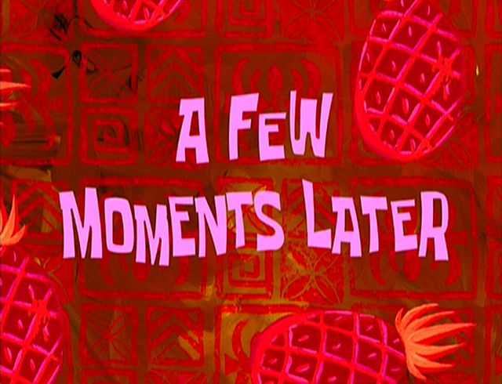

A couple of years ago Medium was a top choice if you wanted to start writing. It was free, beautiful, minimal, and it could attract a lot of readers if the content was good. Although it is still kind of free, today's Medium is something totally different.

Nowadays, if you want to read something on Medium you first need to dismiss a modal, probably a few popups too. The reading experience is much less immersive as header and social sharing buttons are sticky. They track you in the hope they can squeeze a couple more clicks and a few more reads from your attention.

I get it, they need to please their investors and put some food on the table. I just can't make peace with the fact that they are continuing to ruin that reading experience, and transforming their platform into something that could soon resemble Facebook or Youtube. Memberships are probably not enough, desperate times require desperate measures.

I was thinking about building my own blog for a long time. I would set a goal for the next week, but then something else would come. Somebody made React for the terminal. Maybe it's finally time to completely understand CSS Grid. Often it would just be a new series on Netflix (can't wait for the new season of Dark btw).

One morning I was scrolling through the endless depths of Twitter and I saw something interesting. Dan Abramov was linking to an interesting domain, overreacted.io, his new personal blog. It had all the right ingredients to strike a chord with me. It was built with React and Gatsby, which I've recently started using and fell in love with. The design was simple but at the same time, it seemed perfect.

From that moment on I knew the time to build my own custom blog is now. It's going to be simple and clear. With time, I will steal all the good features from the best reading platforms.

I have spent a lot of time in front of the domains search page. After I have gone through all my good names and saw all of them were taken I was very close to abandoning the blog again. Then it struck me, why can't I just give it a boring name. After all, Apple is named after a fruit.

I went through fruits, vegetables, kitchenware, car and rocket parts, all without success. Finally, I settled on the word "splotch", which apparently is:

> "An irregularly shaped spot, stain, or colored or discolored area"

That perfectly describes it. I will occasionally throw some code or content like paint on the wall. Something will stick, some pieces will fall down. In the end, I will always have a _splotch_ on my tiny piece of the internet.
